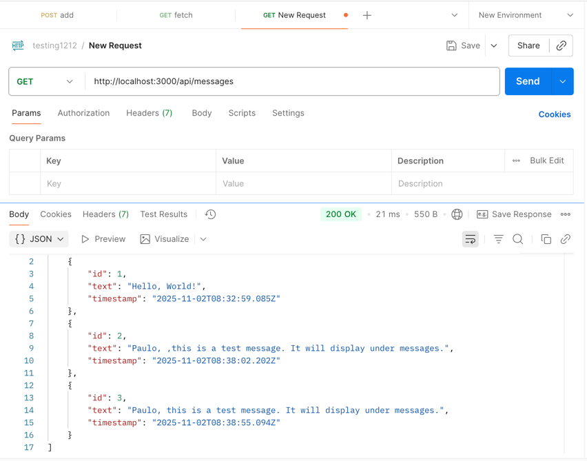
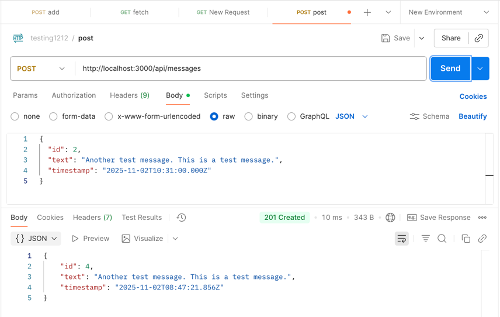

# ExpressEcho

ExpressEcho is a lightweight Express.js server with a modern web interface that demonstrates basic RESTful API operations. It's designed to echo back messages with additional metadata.

## Features

- **RESTful API** - Complete with GET and POST endpoints
- **Modern Web Client** - Clean, responsive UI built with vanilla JavaScript
- **Real-time Updates** - See new messages immediately after posting
- **Responsive Design** - Works seamlessly on both desktop and mobile devices
- **Simple Setup** - Get up and running in minutes

## Quick Start

### Prerequisites

- Node.js (v14 or later)
- npm (comes with Node.js) or yarn

### Installation

1. Clone the repository
   ```bash
   git clone https://github.com/agnunga/express-echo.git
   cd express-echo
   ```

2. Install dependencies:
   ```bash
   npm install
   ```

3. Start the development server:
   ```bash
   npm run dev
   ```

4. Open your browser and navigate to:
   ```
   http://localhost:3000
   ```

## User Interface


*Figure 2: Message input form with validation*

## API Documentation

### Base URL
```
http://localhost:3000/api
```

### Endpoints

#### GET `/api/messages`
Retrieves all messages.

**Response:**
```json
[
  {
    "id": 1,
    "text": "Hello, World!",
    "timestamp": "2025-11-02T10:30:00.000Z"
  }
]
```

#### POST `/api/messages`
Adds a new message.

**Request Body:**
```json
{
  "text": "Your message here"
}
```

**Success Response (201 Created):**
```json
{
  "id": 2,
  "text": "Another test message. This is a test message.",
  "timestamp": "2025-11-02T10:31:00.000Z"
}
```

**Error Response (400 Bad Request):**
```json
{
  "error": "Message text is required"
}
```

## Mobile Responsiveness - after clicking "Refresh messages" button


*Figure 3: ExpressEcho interface on mobile devices*

## Acknowledgments

- Built with [Express.js](https://expressjs.com/)
- Styled with custom CSS

## Project Structure

```
simple-express-server/
├── public/               # Static files (HTML, CSS, JS)
│   ├── index.html        # Client interface
│   └── styles.css        # Styling for the client
├── index.js              # Express server
├── package.json          # Project dependencies and scripts
└── README.md             # This file. Documentation!
```

## Usage

1. Open your browser and navigate to `http://localhost:3000`
2. Use the form to add new messages
3. Messages will be displayed below the form
4. Click "Refresh Messages" to manually refresh the message list - especially if the message was added via api from another user agent
